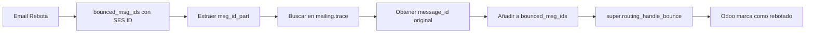

# 📧 AWS SES Mail Tracking - Odoo Module

## 📑 Tabla de Contenidos

- [Descripción General del Módulo](#descripción-general-del-módulo)
- [El Problema que Resuelve](#el-problema-que-resuelve)
- [Arquitectura del Módulo](#arquitectura-del-módulo)
- [Estructura de Archivos Completa](#estructura-de-archivos-completa)
- [Componentes Core vs Auxiliares](#componentes-core-vs-auxiliares)
- [Documentación Técnica Detallada](#documentación-técnica-detallada)
  - [Models (Modelos)](#models-modelos)
  - [Views (Vistas)](#views-vistas)
  - [Libs (Bibliotecas Personalizadas)](#libs-bibliotecas-personalizadas)
- [Flujos de Trabajo](#flujos-de-trabajo)
- [Instalación y Configuración](#instalación-y-configuración)
- [Dependencias](#dependencias)
- [Debugging y Logging](#debugging-y-logging)

---

## 📋 Descripción General del Módulo

**AWS SES Mail Tracking** es un módulo personalizado para Odoo 18 que integra el servicio **Amazon Simple Email Service (SES)** con el sistema de correo electrónico de Odoo, específicamente con las capacidades de **Email Marketing (Mass Mailing)**.

### Propósito Principal:

Este módulo resuelve el problema de correlación de IDs de mensaje cuando se envían emails a través de AWS SES, permitiendo el correcto seguimiento (tracking) de:

- ✅ Emails enviados
- ✅ Emails entregados
- ✅ Emails abiertos
- ✅ Respuestas (replies)
- ✅ Rebotes (bounces)

### Versión:

- **Odoo**: 18.0
- **Módulo**: 5.0.0
- **Licencia**: LGPL-3

---

## 🔍 El Problema que Resuelve

### El Desafío:

Cuando Odoo envía un email a través de un servidor SMTP normal:

1. Odoo genera un `Message-ID` único (ej: `<1234567890.1.odoo@midominio.com>`)
2. Este ID se guarda en la base de datos
3. Cuando llegan respuestas o rebotes, Odoo los correlaciona usando este ID

### El Problema con AWS SES:

**AWS SES cambia el Message-ID** durante el envío:

```
ANTES (Odoo genera):
<1234567890.1.odoo@midominio.com>

DESPUÉS (SES lo reemplaza):
<0100019ae9321ea7-f8c2d1a3-b5e4-4f6a-9c7d-1234567890ab@us-east-1.amazonses.com>
```

Además, **el dominio en los rebotes es diferente**:

```
SES envía con:      @us-east-1.amazonses.com
SES rebota con:     @email.amazonses.com
```

**Resultado**: Odoo no puede correlacionar rebotes, respuestas o aperturas porque busca el Message-ID original que ya no existe.

### La Solución:

Este módulo:

1. **Captura** el nuevo Message-ID que SES asigna al email
2. **Almacena** ambos IDs (el original de Odoo y el de SES)
3. **Normaliza** las búsquedas para que funcionen sin importar el dominio
4. **Correlaciona** correctamente rebotes y respuestas

---

## 🏗️ Arquitectura del Módulo

```
┌─────────────────────────────────────────────────────────────────────────┐
│                         ARQUITECTURA DEL MÓDULO                         │
└─────────────────────────────────────────────────────────────────────────┘

┌──────────────┐         ┌──────────────────────┐         ┌─────────────┐
│  Odoo Core   │         │  Nuestro Módulo      │         │   AWS SES   │
├──────────────┤         ├──────────────────────┤         ├─────────────┤
│              │         │                      │         │             │
│ ir.mail_     │◄────────┤ IrMailServer         │────────►│ SES SMTP    │
│ server       │ Override│ (send_email)         │ Envía   │ Server      │
│              │         │                      │         │             │
│              │         │        │             │         │             │
│              │         │        │ Usa         │         │             │
│              │         │        ▼             │         │             │
│              │         │  SMTPInherit ────────┼─────────┤ Captura     │
│              │         │  (retorna resp)      │  Resp   │ Message-ID  │
│              │         │                      │         │             │
├──────────────┤         ├──────────────────────┤         └─────────────┘
│              │         │                      │
│ mail.thread  │◄────────┤ MailThread           │
│              │ Override│ (bounces/replies)    │
│              │         │                      │
├──────────────┤         ├──────────────────────┤
│              │         │                      │         ┌─────────────┐
│ mailing.     │◄────────┤ MailingTrace         │────────►│  Database   │
│ trace        │ Extend  │ (+ses_message_id)    │ Guarda  ├─────────────┤
│              │         │                      │         │ mailing.    │
└──────────────┘         └──────────────────────┘         │ trace       │
                                                          ├─────────────┤
                                                          │ - message_id│
                                                          │ - ses_msg_id│
                                                          └─────────────┘

FLUJO DE DATOS:
  1. IrMailServer usa SMTPInherit para enviar emails via SES
  2. SMTPInherit captura la respuesta SES con el nuevo Message-ID
  3. IrMailServer guarda ambos IDs en mailing.trace
  4. MailThread usa ambos IDs para correlacionar rebotes y respuestas
```

### Capas del Módulo:

| Capa                        | Propósito                                              | Archivos                       |
| --------------------------- | ------------------------------------------------------ | ------------------------------ |
| **Transporte SMTP**         | Personaliza el envío SMTP para capturar respuestas SES | `libs/smtplib_inherit.py`      |
| **Servidor de Correo**      | Intercepta el envío y guarda el SES Message-ID         | `models/ir_mail_server.py`     |
| **Procesamiento de Correo** | Maneja rebotes y respuestas normalizando IDs           | `models/mail_thread.py`        |
| **Almacenamiento**          | Añade campo para almacenar SES Message-ID              | `models/mailing_trace.py`      |
| **UI**                      | Muestra ambos IDs en la interfaz                       | `views/mailing_trace_view.xml` |

---

## 📂 Estructura de Archivos Completa

```
aws_ses_mail_tracking/
│
├── __init__.py                          # Punto de entrada del módulo
├── __manifest__.py                      # Metadatos y configuración del módulo
│
├── models/                              # Modelos Python (lógica de negocio)
│   ├── __init__.py                      # Importa todos los modelos
│   ├── ir_mail_server.py               # ⭐ CORE: Manejo del envío SMTP y captura de SES ID
│   ├── mail_thread.py                  # ⭐ CORE: Procesamiento de rebotes y respuestas
│   └── mailing_trace.py                # ⭐ CORE: Extensión del modelo de trazas
│
├── libs/                                # Bibliotecas personalizadas
│   ├── __init__.py
│   └── smtplib_inherit.py              # ⭐ CORE: SMTP personalizado para capturar respuesta
│
├── views/                               # Vistas XML (interfaz de usuario)
│   └── mailing_trace_view.xml          # Vista para mostrar SES Message-ID
│
└── static/                              # Recursos estáticos (vacío actualmente)
```

### Explicación de Directorios:

#### 📁 Raíz del Módulo

- **`__init__.py`**: Importa el directorio `models`. Es el punto de entrada cuando Odoo carga el módulo.
- **`__manifest__.py`**: Archivo de configuración que define:
  - Nombre del módulo
  - Versión
  - Dependencias (`mail`, `mass_mailing`)
  - Archivos de datos y vistas a cargar
  - Metadatos (autor, licencia, categoría)

#### 📁 models/

Contiene toda la lógica de negocio del módulo. Odoo usa el patrón **MVC** (Model-View-Controller), y estos son los Models.

#### 📁 libs/

Bibliotecas auxiliares que no son modelos Odoo pero sí código Python reutilizable.

#### 📁 views/

Definiciones XML de cómo se muestra la información en la interfaz de Odoo.

#### 📁 static/

Recursos estáticos como CSS, JavaScript, imágenes (actualmente no usado).

---

## 🎯 Componentes Core vs Auxiliares

### ⭐ COMPONENTES CORE (Imprescindibles)

Estos archivos son **absolutamente necesarios** para que el módulo funcione correctamente:

| Archivo                    | Criticidad     | Razón                                      |
| -------------------------- | -------------- | ------------------------------------------ |
| `__manifest__.py`          | 🔴 **CRÍTICO** | Sin esto, Odoo no puede instalar el módulo |
| `__init__.py` (raíz)       | 🔴 **CRÍTICO** | Punto de entrada del módulo                |
| `models/__init__.py`       | 🔴 **CRÍTICO** | Importa los modelos                        |
| `models/ir_mail_server.py` | 🔴 **CRÍTICO** | Captura y guarda el SES Message-ID         |
| `models/mail_thread.py`    | 🔴 **CRÍTICO** | Correlaciona rebotes y respuestas          |
| `models/mailing_trace.py`  | 🔴 **CRÍTICO** | Añade el campo `ses_message_id`            |
| `libs/smtplib_inherit.py`  | 🔴 **CRÍTICO** | Retorna la respuesta SES completa          |
| `libs/__init__.py`         | 🔴 **CRÍTICO** | Importa SMTPInherit                        |

### 🟡 COMPONENTES AUXILIARES (Opcionales pero Útiles)

Estos archivos mejoran la funcionalidad pero el módulo podría funcionar sin ellos:

| Archivo                        | Criticidad      | Razón                   | Efecto si se Elimina              |
| ------------------------------ | --------------- | ----------------------- | --------------------------------- |
| `views/mailing_trace_view.xml` | 🟡 **OPCIONAL** | Muestra el SES ID en UI | No verías el campo en la interfaz |

---

## 📚 Documentación Técnica Detallada

### Models (Modelos)

#### 🔷 1. `models/ir_mail_server.py`

**Propósito**: Extender el servidor de correo de Odoo para capturar y almacenar el Message-ID generado por AWS SES.

##### Herencia:

```python
class IrMailServer(models.Model):
    _inherit = "ir.mail_server"
```

- **`_inherit`**: Extiende el modelo existente sin crear una nueva tabla
- **Modelo base**: `ir.mail_server` del módulo `base` de Odoo

##### Métodos Sobrescritos:

###### 1. `connect()` (Líneas 29-154)

**Función**: Establece la conexión SMTP con el servidor de correo.

**Modificación Clave** (Líneas 124-125):

```python
# Original Odoo:
connection = smtplib.SMTP(smtp_server, smtp_port, timeout=SMTP_TIMEOUT)

# Nuestro módulo:
connection = smtplib_inherit.SMTPInherit(smtp_server, smtp_port, timeout=SMTP_TIMEOUT)
```

**¿Por qué?**:

- La clase estándar `smtplib.SMTP` de Python tiene un método `sendmail()` que no retorna la respuesta completa del servidor
- Nuestra clase `SMTPInherit` sobrescribe `sendmail()` para **retornar la respuesta completa** del servidor SES
- Esta respuesta contiene el nuevo Message-ID que SES asignó al email

**Criticidad**: 🔴 **CRÍTICA** - Sin esto no podemos capturar el SES Message-ID

###### 2. `send_email()` (Líneas 156-220)

**Función**: Envía el email y procesa la respuesta.

**Flujo Normal de Odoo**:

```python
1. Preparar mensaje
2. Enviar via SMTP
3. Retornar el Message-ID original
```

**Nuestro Flujo Mejorado** (Líneas 193-207):

```python
# 1. Enviar el email
resp = smtp.send_message(message, smtp_from, smtp_to_list)

# 2. Detectar si es AWS SES analizando el hostname
host_split = smtp._host.split(".")
(region, domain) = host_split[1], f"{host_split[2]}.{host_split[3]}"

# 3. Si es SES (domain == "amazonaws.com")
if domain == "amazonaws.com":
    # 4. Extraer el nuevo Message-ID de la respuesta
    #    Respuesta típica: "250 Ok 0100019ae9321ea7-..."
    ses_message_id = f"<{resp.decode().split(' ')[1]}@{region}.amazonses.com>"

    # 5. Buscar el registro de traza en mailing.trace
    trace = self.env['mailing.trace'].search([('message_id', '=', message_id)])

    # 6. Guardar el SES Message-ID
    if trace:
        trace[0].ses_message_id = ses_message_id
```

**Ejemplo Completo**:

```
Original Message-ID (generado por Odoo):
<1733391234.123.odoo@miempresa.com>

Respuesta de SES:
250 Ok 0100019ae9321ea7-f8c2d1a3-b5e4-4f6a-9c7d-1234567890ab

SES Message-ID construido:
<0100019ae9321ea7-f8c2d1a3-b5e4-4f6a-9c7d-1234567890ab@us-east-1.amazonses.com>

Almacenamiento en mailing.trace:
- message_id: <1733391234.123.odoo@miempresa.com>
- ses_message_id: <0100019ae9321ea7-f8c2d1a3-b5e4-4f6a-9c7d-1234567890ab@us-east-1.amazonses.com>
```

**Logging Extensivo** (Líneas 199-207):

```python
_logger.info(f"[SES SEND DEBUG] Original message_id: {message_id}")
_logger.info(f"[SES SEND DEBUG] Generated ses_message_id: {ses_message_id}")
_logger.info(f"[SES SEND DEBUG] Found {len(trace)} mailing.trace records")
_logger.info(f"[SES SEND DEBUG] Stored ses_message_id in trace ID: {trace[0].id}")
```

**¿Dónde ver estos logs?**

- Archivo: `/var/log/odoo/odoo-server.log` (en producción)
- Terminal: Si ejecutas Odoo en modo desarrollo

**Criticidad**: 🔴 **CRÍTICA** - Este es el corazón del módulo

---

#### 🔷 2. `models/mail_thread.py`

**Propósito**: Procesar respuestas y rebotes de emails, correlacionándolos correctamente con los emails enviados incluso cuando AWS SES ha cambiado el Message-ID.

##### Herencia:

```python
class MailThread(models.AbstractModel):
    _inherit = 'mail.thread'
```

- **`AbstractModel`**: No crea tabla en la base de datos
- **`mail.thread`**: Modelo abstracto que proporciona capacidades de mensajería a otros modelos

##### Métodos Sobrescritos:

###### 1. `_message_route_process()` (Líneas 15-40)

**Función**: Procesa mensajes entrantes (respuestas) y los asocia con el hilo de conversación correcto.

**El Problema**:
Cuando un usuario responde a un email, su cliente de correo incluye una cabecera `References` o `In-Reply-To` con el Message-ID original:

```
References: <0100019ae9321ea7-...@us-east-1.amazonses.com>
```

Pero Odoo busca por el `message_id` que generó originalmente, no encuentra coincidencia, y no sabe a qué email se está respondiendo.

**La Solución**:

```python
# 1. Extraer todas las referencias del mensaje entrante
thread_references = message_dict['references'] or message_dict['in_reply_to']
msg_references = MAIL_HEADER_MSGID_RE.findall(thread_references or "")

# 2. Normalizar IDs eliminando el dominio
#    <0100019ae9321ea7-...@us-east-1.amazonses.com> -> 0100019ae9321ea7-...
normalized_refs = [ref.split('@')[0] for ref in msg_references]

# 3. Buscar en mailing.trace por message_id (búsqueda normal de Odoo)
self.env['mailing.trace'].set_opened(domain=[('message_id', 'in', msg_references)])
self.env['mailing.trace'].set_replied(domain=[('message_id', 'in', msg_references)])

# 4. TAMBIÉN buscar por SES message ID normalizado (nuestra mejora)
self.env['mailing.trace'].set_opened(domain=[('ses_message_id', 'ilike', normalized_refs[0])])
self.env['mailing.trace'].set_replied(domain=[('ses_message_id', 'ilike', normalized_refs[0])])
```

**¿Qué hace `ilike`?**

- `ilike` = case-insensitive LIKE (SQL)
- Busca coincidencias parciales ignorando mayúsculas/minúsculas
- Permite encontrar el ID sin importar el dominio

**Ejemplo**:

```sql
-- Si normalized_refs[0] = "0100019ae9321ea7-abc-def"
-- Y ses_message_id en DB = "<0100019ae9321ea7-abc-def@us-east-1.amazonses.com>"

SELECT * FROM mailing_trace
WHERE ses_message_id ILIKE '%0100019ae9321ea7-abc-def%'

-- ✅ COINCIDE (encuentra el registro)
```

**Criticidad**: 🔴 **CRÍTICA** - Necesario para tracking de respuestas

###### 2. `_routing_handle_bounce()` (Líneas 43-99)

**Función**: Procesa emails de rebote (bounces) y marca los registros correspondientes como "rebotados".

**El Problema del Dominio**:

AWS SES tiene un comportamiento peculiar con los dominios:

```
Envío:   <ID@us-east-1.amazonses.com>
Rebote:  <ID@email.amazonses.com>
```

**Diferentes dominios** = Odoo no puede encontrar el email original.

**La Solución**:

```python
# 1. Obtener los Message-IDs que rebotaron
bounced_msg_ids = message_dict.get('bounced_msg_ids', [])

# 2. Para cada ID que rebotó
for bounced_id in bounced_msg_ids:
    # Extraer solo la parte del ID (antes del @)
    # <0100019ae9321ea7-...@email.amazonses.com> -> 0100019ae9321ea7-...
    msg_id_part = bounced_id.strip('<>').split('@')[0]

    # Buscar en mailing.trace ignorando el dominio
    traces = self.env['mailing.trace'].search([
        ('ses_message_id', 'ilike', msg_id_part)
    ])
    traces_with_ses_ids |= traces

# 3. Obtener los Message-IDs originales de Odoo
original_msg_ids = traces_with_ses_ids.mapped('message_id')

# 4. Añadirlos a bounced_msg_ids para que Odoo los procese
extended_bounced_msg_ids = list(set(bounced_msg_ids + original_msg_ids))
message_dict['bounced_msg_ids'] = extended_bounced_msg_ids

# 5. Llamar al método original de Odoo (ahora con IDs traducidos)
super(MailThread, self)._routing_handle_bounce(email_message, message_dict)
```

**Flujo Completo**:



**Fallback para Mass Mailing** (Líneas 89-99):

Si el email no se encuentra en `mail.mail` (emails individuales), también buscamos en `mailing.trace` (mass mailing):

```python
traces_by_message_id = self.env['mailing.trace'].search([
    ('message_id', 'in', bounced_msg_ids)
])

if bounced_msg_ids and not traces_by_message_id:
    for bounced_id in bounced_msg_ids:
        msg_id_part = bounced_id.strip('<>').split('@')[0]
        self.env['mailing.trace'].set_bounced(
            domain=[('ses_message_id', 'ilike', msg_id_part)],
            bounce_message=tools.html2plaintext(message_dict.get('body') or '')
        )
```

**Logging Extensivo** (Líneas 49-85):

```python
_logger.info(f"[SES BOUNCE DEBUG] bounced_msg_ids from Odoo: {bounced_msg_ids}")
_logger.info(f"[SES BOUNCE DEBUG] Searching for message ID part: {msg_id_part}")
_logger.info(f"[SES BOUNCE DEBUG] Found {len(traces_with_ses_ids)} traces with SES IDs")
```

**Criticidad**: 🔴 **CRÍTICA** - Necesario para tracking de rebotes

---

#### 🔷 3. `models/mailing_trace.py`

**Propósito**: Extender el modelo `mailing.trace` para añadir un campo que almacene el SES Message-ID.

##### Código Completo:

```python
from odoo import fields, models

class MailingTrace(models.Model):
    _inherit = 'mailing.trace'

    ses_message_id = fields.Char("SES Message-ID")
```

**Explicación**:

- **`_inherit = 'mailing.trace'`**: Extiende el modelo existente
- **`ses_message_id`**: Nuevo campo de tipo `Char` (string)
- **Tipo de campo**: `Char` = VARCHAR en SQL

**En la Base de Datos**:

Odoo automáticamente añade esta columna a la tabla `mailing_trace`:

```sql
ALTER TABLE mailing_trace
ADD COLUMN ses_message_id VARCHAR;
```

**¿Qué es `mailing.trace`?**

Es una tabla de Odoo que registra cada email enviado en una campaña de mass mailing:

| Campo                | Descripción                 |
| -------------------- | --------------------------- |
| `id`                 | ID único                    |
| `message_id`         | Message-ID original de Odoo |
| `email`              | Destinatario                |
| `sent`               | Fecha de envío              |
| `opened`             | Fecha de apertura           |
| `replied`            | Fecha de respuesta          |
| `bounced`            | Fecha de rebote             |
| `mass_mailing_id`    | Campaign asociada           |
| **`ses_message_id`** | **Nuestro campo nuevo**     |

**Criticidad**: 🔴 **CRÍTICA** - Sin este campo no hay dónde almacenar el SES ID

---

### Libs (Bibliotecas Personalizadas)

#### 🔷 `libs/smtplib_inherit.py`

**Propósito**: Crear una clase SMTP personalizada que retorne la respuesta completa del servidor.

##### Código Completo Explicado:

```python
import re
from smtplib import SMTP, CRLF, SMTPSenderRefused, SMTPRecipientsRefused, SMTPDataError

def _fix_eols(data):
    """Normaliza los finales de línea a CRLF (requerido por SMTP)"""
    return re.sub(r'(?:\r\n|\n|\r(?!\n))', CRLF, data)

class SMTPInherit(SMTP):
    """Extiende smtplib.SMTP para retornar la respuesta del servidor"""

    def sendmail(self, from_addr, to_addrs, msg, mail_options=(), rcpt_options=()):
        """
        Sobrescribe sendmail() para retornar la respuesta completa

        Args:
            from_addr: Email del remitente
            to_addrs: Lista de destinatarios
            msg: Contenido del mensaje
            mail_options: Opciones SMTP (ej: SMTPUTF8)
            rcpt_options: Opciones para destinatarios

        Returns:
            resp: Respuesta del servidor tras DATA command
        """

        # 1. Asegurar que EHLO/HELO fue enviado
        self.ehlo_or_helo_if_needed()

        # 2. Preparar opciones ESMTP
        esmtp_opts = []
        if isinstance(msg, str):
            msg = _fix_eols(msg).encode('ascii')
        if self.does_esmtp:
            if self.has_extn('size'):
                esmtp_opts.append(f"size={len(msg)}")
            for option in mail_options:
                esmtp_opts.append(option)

        # 3. MAIL FROM command
        (code, resp) = self.mail(from_addr, esmtp_opts)
        if code != 250:
            if code == 421:
                self.close()
            else:
                self._rset()
            raise SMTPSenderRefused(code, resp, from_addr)

        # 4. RCPT TO commands (uno por destinatario)
        senderrs = {}
        if isinstance(to_addrs, str):
            to_addrs = [to_addrs]
        for each in to_addrs:
            (code, resp) = self.rcpt(each, rcpt_options)
            if (code != 250) and (code != 251):
                senderrs[each] = (code, resp)
            if code == 421:
                self.close()
                raise SMTPRecipientsRefused(senderrs)

        if len(senderrs) == len(to_addrs):
            # El servidor rechazó todos los destinatarios
            self._rset()
            raise SMTPRecipientsRefused(senderrs)

        # 5. DATA command (envía el contenido del email)
        (code, resp) = self.data(msg)
        if code != 250:
            if code == 421:
                self.close()
            else:
                self._rset()
            raise SMTPDataError(code, resp)

        # ⭐ CLAVE: Retornar la respuesta del servidor
        # En SES esta respuesta contiene el nuevo Message-ID
        return resp
```

**Diferencia con `smtplib.SMTP` Original**:

```python
# smtplib.SMTP original:
def sendmail(...):
    # ... código ...
    (code, resp) = self.data(msg)
    # ... manejo de errores ...
    # NO retorna resp (no retorna nada)

# Nuestro SMTPInherit:
def sendmail(...):
    # ... mismo código ...
    (code, resp) = self.data(msg)
    # ... manejo de errores ...
    return resp  # ⭐ RETORNAMOS LA RESPUESTA
```

**Ejemplo de Respuesta SES**:

```
Código: 250
Respuesta: b'Ok 0100019ae9321ea7-f8c2d1a3-b5e4-4f6a-9c7d-1234567890ab'
```

**Criticidad**: 🔴 **CRÍTICA** - Sin esto no podemos obtener el SES Message-ID

---

### Views (Vistas)

#### 🔷 `views/mailing_trace_view.xml`

**Propósito**: Añadir el campo `ses_message_id` a la vista de formulario de `mailing.trace` para que sea visible en la interfaz de usuario.

##### Código Completo Explicado:

```xml
<?xml version="1.0" encoding="utf-8"?>
<odoo>

    <record id="mailing_trace_form_view_inherit" model="ir.ui.view">
        <!-- ID único de esta vista -->
        <field name="name">mailing.trace.form.view.inherit</field>

        <!-- Modelo al que aplica -->
        <field name="model">mailing.trace</field>

        <!-- Vista que estamos extendiendo -->
        <field name="inherit_id" ref="mass_mailing.mailing_trace_view_form"/>

        <!-- Modificaciones XML -->
        <field name="arch" type="xml">
            <!-- Buscar el campo 'message_id' -->
            <xpath expr="//field[@name='message_id']" position="after">
                <!-- Añadir nuestro campo justo después -->
                <field string="SES Message-ID" name="ses_message_id"/>
            </xpath>
        </field>
    </record>

</odoo>
```

**Explicación de Herencia de Vistas en Odoo**:

1. **`inherit_id`**: Referencia a la vista que queremos extender

   - `mass_mailing.mailing_trace_view_form` es la vista original del módulo `mass_mailing`

2. **`xpath`**: Selector XML para encontrar dónde insertar nuestro código

   - `expr="//field[@name='message_id']"`: Busca el campo llamado `message_id`
   - `position="after"`: Inserta nuestro campo después de ese

3. **Resultado Visual**:

```
┌─ Mailing Trace Form ─────────────┐
│                                  │
│ Message-ID:  <123@odoo.com>     │
│ SES Message-ID: <456@amazonses> │  ← Nuestro campo
│ Email: usuario@ejemplo.com       │
│ ...                              │
└──────────────────────────────────┘
```

**¿Dónde Se Ve Esto?**

En Odoo:

1. Ve a **Email Marketing** → **Mailings**
2. Abre una campaña enviada
3. Click en **Recipients** → Abre un destinatario
4. Verás ambos Message-IDs en el formulario

**Criticidad**: 🟡 **OPCIONAL** - Útil para debugging pero no necesario para la funcionalidad

---

## 🔄 Flujos de Trabajo

### Flujo 1: Envío de Email via SES

```
┌─────────────────────────────────────────────────────────────────────────┐
│                    FLUJO 1: ENVÍO DE EMAIL VIA SES                      │
└─────────────────────────────────────────────────────────────────────────┘

Usuario          Odoo           IrMailServer      SMTPInherit      AWS SES        Database
   │              Core            (Módulo)                                          (mailing.trace)
   │               │                  │                  │             │                │
   │─ Enviar ─────►│                  │                  │             │                │
   │  Campaña      │                  │                  │             │                │
   │               │                  │                  │             │                │
   │               │─ Genera ID ─────►│                  │             │                │
   │               │ <123@odoo.com>   │                  │             │                │
   │               │                  │                  │             │                │
   │               │─ Crea registro ──┼──────────────────┼─────────────┼───────────────►│
   │               │ message_id=123   │                  │             │                │
   │               │                  │                  │             │                │
   │               │─ send_email() ──►│                  │             │                │
   │               │                  │                  │             │                │
   │               │                  │─ connect() ─────►│             │                │
   │               │                  │  SMTPInherit     │             │                │
   │               │                  │                  │             │                │
   │               │                  │                  │─ Handshake ►│                │
   │               │                  │                  │◄─ OK ───────│                │
   │               │                  │                  │             │                │
   │               │                  │─ send_message() ►│             │                │
   │               │                  │                  │─ Envía ────►│                │
   │               │                  │                  │  email      │                │
   │               │                  │                  │             │                │
   │               │                  │                  │             │─ Reemplaza ID  │
   │               │                  │                  │             │ <456@amazonses>│
   │               │                  │                  │             │                │
   │               │                  │                  │◄─ 250 Ok ───│                │
   │               │                  │                  │  456...     │                │
   │               │                  │◄─ resp ──────────│             │                │
   │               │                  │ b'Ok 456...'     │             │                │
   │               │                  │                  │             │                │
   │               │                  │─ Extrae SES ID   │             │                │
   │               │                  │ <456@us-east-1   │             │                │
   │               │                  │  .amazonses.com> │             │                │
   │               │                  │                  │             │                │
   │               │                  │─ UPDATE ─────────┼─────────────┼───────────────►│
   │               │                  │ ses_message_id   │             │        ✅ Guardado:
   │               │                  │ = <456@...>      │             │        message_id
   │               │                  │                  │             │        ses_message_id
   │               │◄─ message_id ────│                  │             │                │
   │               │  original        │                  │             │                │
   │               │                  │                  │             │                │
   │◄─ Enviado ────│                  │                  │             │                │
   │    ✅         │                  │                  │             │                │

RESULTADO: Ambos IDs almacenados en mailing.trace
  • message_id: <123@odoo.com>
  • ses_message_id: <456@us-east-1.amazonses.com>
```

**Pasos Detallados**:

1. **Usuario** envía una campaña de email marketing
2. **Odoo Core** genera un Message-ID único (ej: `<1733391234.123@odoo.com>`)
3. **Base de Datos** crea un registro en `mailing.trace` con este ID
4. **IrMailServer** (nuestro módulo) establece conexión usando `SMTPInherit`
5. **SES** recibe el email y lo reemplaza con su propio ID
6. **SES** retorna: `250 Ok 0100019ae9-...`
7. **IrMailServer** captura esta respuesta y construye el SES Message-ID completo
8. **Base de Datos** se actualiza con `ses_message_id`
9. Ahora tenemos **ambos** IDs almacenados

---

### Flujo 2: Procesamiento de Rebote (Bounce)

```
┌─────────────────────────────────────────────────────────────────────────┐
│              FLUJO 2: PROCESAMIENTO DE REBOTE (BOUNCE)                  │
└─────────────────────────────────────────────────────────────────────────┘

AWS SES        Odoo Mail       MailThread         Database         Usuario
               Server           (Módulo)        (mailing.trace)
   │               │                │                 │                │
   │─ Rebote ─────►│                │                 │                │
   │ MAILER-DAEMON │                │                 │                │
   │ References:   │                │                 │                │
   │ <456@email    │                │                 │                │
   │ .amazonses>   │                │                 │                │
   │               │                │                 │                │
   │               │─ Parsea ───────┤                 │                │
   │               │ rebote         │                 │                │
   │               │ ID: <456@email │                 │                │
   │               │    .amazonses> │                 │                │
   │               │                │                 │                │
   │               │─ handle_bounce►│                 │                │
   │               │ (message_dict) │                 │                │
   │               │                │                 │                │
   │               │                │─ Extrae ID      │                │
   │               │                │ <456@email...>  │                │
   │               │                │                 │                │
   │               │            ⚠️ PROBLEMA:          │                │
   │               │            Dominio diferente     │                │
   │               │            Envío: @us-east-1     │                │
   │               │            Rebote: @email        │                │
   │               │                │                 │                │
   │               │                │─ Normaliza      │                │
   │               │                │ Solo: '456...'  │                │
   │               │                │ (sin dominio)   │                │
   │               │                │                 │                │
   │               │                │─ SELECT ───────►│                │
   │               │                │ WHERE ses_msg   │                │
   │               │                │ ILIKE '%456%'   │                │
   │               │                │                 │                │
   │               │                │◄─ Encontrado ───│                │
   │               │                │ message_id:     │                │
   │               │                │ <123@odoo.com>  │                │
   │               │                │                 │                │
   │               │                │─ Traduce IDs    │                │
   │               │                │ Añade <123@     │                │
   │               │                │ odoo.com>       │                │
   │               │                │                 │                │
   │               │◄─ super() ─────│                 │                │
   │               │ (con IDs       │                 │                │
   │               │  traducidos)   │                 │                │
   │               │                │                 │                │
   │               │─ UPDATE ───────┼────────────────►│                │
   │               │ SET bounced =  │                 │                │
   │               │ NOW()          │                 │                │
   │               │                │                 │                │
   │               │─ Notifica ─────┼─────────────────┼───────────────►│
   │               │ rebote         │                 │        ✅ Email│
   │               │                │                 │        marcado │
   │               │                │                 │        rebotado│

CLAVE: Normalización permite encontrar el email original a pesar del cambio de dominio
```

**Pasos Detallados**:

1. **AWS SES** envía un email de rebote a Odoo
2. **Odoo** parsea el rebote y extrae el Message-ID de las cabeceras `References`
3. **Problema**: El ID viene como `<456@email.amazonses.com>` (dominio diferente al envío)
4. **MailThread** (nuestro módulo) intercepta el proceso
5. **Normalización**: Extrae solo `456...` sin el dominio
6. **Base de Datos**: Busca en `mailing.trace` usando `ILIKE` (búsqueda parcial)
7. **Traducción**: Encuentra que `ses_message_id=<456@us-east-1.amazonses.com>` corresponde a `message_id=<123@odoo.com>`
8. **Solución**: Añade el `message_id` original a la lista de rebotes
9. **Odoo Core** procesa el rebote normalmente usando el ID traducido
10. **Usuario** ve el email marcado como "Rebotado" en la campaña

---

### Flujo 3: Procesamiento de Respuesta (Reply)

```
┌─────────────────────────────────────────────────────────────────────────┐
│             FLUJO 3: PROCESAMIENTO DE RESPUESTA (REPLY)                 │
└─────────────────────────────────────────────────────────────────────────┘

Cliente         Odoo Mail       MailThread         Database
Email           Server           (Módulo)        (mailing.trace)
   │               │                │                 │
   │─ Reply ──────►│                │                 │
   │ References:   │                │                 │
   │ <456@us-east-1│                │                 │
   │ .amazonses>   │                │                 │
   │               │                │                 │
   │               │─ route_process►│                 │
   │               │ (message)      │                 │
   │               │                │                 │
   │               │                │─ Extrae refs   │
   │               │                │ <456@us-east-1 │
   │               │                │  .amazonses>   │
   │               │                │                 │
   │               │                │─ Normaliza     │
   │               │                │ Solo: '456...' │
   │               │                │ (sin dominio)  │
   │               │                │                 │
   │               │            DOBLE BÚSQUEDA:       │
   │               │                │                 │
   │               │                │─ SELECT 1 ─────►│
   │               │                │ WHERE           │
   │               │                │ message_id IN   │
   │               │                │ (...)           │
   │               │                │                 │
   │               │                │─ SELECT 2 ─────►│
   │               │                │ WHERE ses_msg   │
   │               │                │ ILIKE '%456%'   │
   │               │                │                 │
   │               │                │◄─ Encontrado ───│
   │               │                │ Trace del email│
   │               │                │                 │
   │               │                │─ UPDATE ───────►│
   │               │                │ SET opened =   │
   │               │                │ NOW(),         │
   │               │                │ replied = NOW()│
   │               │                │                 │
   │               │◄─ super() ─────│                 │
   │               │ route_process  │                 │
   │               │                │                 │
   │               │─ Crea ─────────┤                 │
   │               │ mail.message   │                 │
   │               │ en hilo        │                 │
   │               │                │         ✅ Email│
   │               │                │         marcado │
   │               │                │         abierto │
   │               │                │         y       │
   │               │                │         respondido

RESULTADO: Email correctamente correlacionado y estadísticas actualizadas
```

**Pasos Detallados**:

1. **Cliente** (Gmail, Outlook, etc.) responde al email
2. Su cliente incluye `References: <456@us-east-1.amazonses.com>`
3. **MailThread** extrae estas referencias
4. **Doble Búsqueda**:
   - Primero intenta buscar por `message_id` (por si no es SES)
   - Luego busca por `ses_message_id` usando búsqueda normalizada
5. **Base de Datos** marca el email como "Abierto" y "Respondido"
6. **Odoo Core** crea el mensaje en el hilo de conversación correcto

---

## 🚀 Instalación y Configuración

### Requisitos Previos:

1. **Odoo 18** instalado y funcionando
2. **AWS SES** configurado y verificado
3. **Credenciales SMTP** de AWS SES:
   - Servidor: `email-smtp.us-east-1.amazonaws.com`
   - Puerto: `587` (STARTTLS) o `465` (SSL)
   - Usuario: Tu usuario SMTP de SES
   - Contraseña: Tu contraseña SMTP de SES

### Pasos de Instalación:

#### 1. Descargar el Módulo

```bash
cd /path/to/odoo/addons
git clone <repo-url> aws_ses_mail_tracking
# O copia el directorio manualmente
```

#### 2. Reiniciar Odoo

```bash
sudo systemctl restart odoo
# O si ejecutas manualmente:
./odoo-bin --addons-path=/path/to/addons
```

#### 3. Actualizar Lista de Aplicaciones

En Odoo:

1. Ve a **Aplicaciones** (Apps)
2. Click en **Actualizar Lista de Aplicaciones** (Update Apps List)
3. Busca "AWS SES Mail Tracking"
4. Click en **Instalar** (Install)

#### 4. Configurar Servidor de Correo

1. Ve a **Ajustes** (Settings) → **Técnico** (Technical) → **Servidores de Correo Saliente** (Outgoing Mail Servers)
2. Crea un nuevo servidor o edita el existente:

```
Nombre: AWS SES
Servidor SMTP: email-smtp.us-east-1.amazonaws.com
Puerto: 587
Seguridad de la conexión: TLS (STARTTLS)
Usuario: tu-usuario-smtp-ses
Contraseña: tu-contraseña-smtp-ses
```

3. Click en **Probar Conexión** (Test Connection)

#### 5. Configurar Alias Domain (Opcional)

Edita `data/tracking_reply_data.xml` antes de instalar:

```xml
<field name="name">tudominio.com</field>
<field name="bounce_alias">bounces@tudominio.com</field>
```

O crea manualmente después de instalar:

1. Ve a **Ajustes** → **Técnico** → **Email** → **Alias Domains**
2. Edita el registro creado por el módulo

#### 6. Verificar Instalación

```bash
# Ver logs de Odoo
tail -f /var/log/odoo/odoo-server.log

# Enviar un email de prueba y buscar:
[SES SEND DEBUG] Original message_id: ...
[SES SEND DEBUG] Generated ses_message_id: ...
```

---

## 📦 Dependencias

### Dependencias de Odoo:

Declaradas en `__manifest__.py`:

```python
'depends': ['mail', 'mass_mailing']
```

| Módulo             | Propósito                   | Criticidad |
| ------------------ | --------------------------- | ---------- |
| **`mail`**         | Sistema de correo de Odoo   | 🔴 CRÍTICA |
| **`mass_mailing`** | Email Marketing / Campaigns | 🔴 CRÍTICA |

Sin estos módulos, nuestro módulo no puede instalarse.

### Dependencias Python:

**Incluidas en Python estándar**:

- `smtplib` - Cliente SMTP
- `logging` - Sistema de logs
- `re` - Expresiones regulares
- `ssl` - Conexiones seguras
- `base64` - Codificación
- `copy` - Copia de objetos

**De terceros (incluidas en Odoo)**:

- `OpenSSL` - Certificados SSL/TLS
- `idna` - Manejo de dominios internacionales

**De Odoo**:

- `odoo` - Framework de Odoo
- `odoo.tools` - Utilidades
- `odoo.exceptions` - Excepciones personalizadas

---

## 🐛 Debugging y Logging

### Niveles de Log:

El módulo usa logging extensivo para facilitar debugging:

```python
_logger = logging.getLogger(__name__)
```

### Mensajes de Log Clave:

#### Durante el Envío:

```
[SES SEND DEBUG] Original message_id: <1733391234.123@odoo.com>
[SES SEND DEBUG] Generated ses_message_id: <0100019ae9321ea7-...@us-east-1.amazonses.com>
[SES SEND DEBUG] Found 1 mailing.trace records for message_id
[SES SEND DEBUG] Stored ses_message_id in trace ID: 12345
```

#### Durante Rebotes:

```
[SES BOUNCE DEBUG] bounced_msg_ids from Odoo: ['<0100019ae9321ea7-...@email.amazonses.com>']
[SES BOUNCE DEBUG] Searching for message ID part: 0100019ae9321ea7-...
[SES BOUNCE DEBUG] Found 1 traces with SES IDs
[SES BOUNCE DEBUG] Trace ses_message_ids: ['<0100019ae9321ea7-...@us-east-1.amazonses.com>']
[SES BOUNCE DEBUG] Trace message_ids: ['<1733391234.123@odoo.com>']
[SES BOUNCE DEBUG] Extended bounced_msg_ids: ['<0100019ae9321ea7-...@email.amazonses.com>', '<1733391234.123@odoo.com>']
```

### Cómo Ver los Logs:

#### En Producción:

```bash
tail -f /var/log/odoo/odoo-server.log | grep "SES.*DEBUG"
```

#### En Desarrollo:

```bash
./odoo-bin --log-level=info
```

#### Filtrar Solo SES:

```bash
grep "SES" /var/log/odoo/odoo-server.log
```

### Activar Modo Debug SMTP:

En el servidor de correo de Odoo:

1. Ve a **Servidores de Correo Saliente**
2. Edita tu servidor SES
3. Activa **Modo Debug**
4. Los logs mostrarán la comunicación SMTP completa:

```
send: 'ehlo odoo\r\n'
reply: b'250-email-smtp.amazonaws.com\r\n'
send: 'MAIL FROM:<from@example.com>\r\n'
reply: b'250 Ok\r\n'
...
```

### Troubleshooting Común:

#### Problema 1: No se guarda `ses_message_id`

**Síntoma**:

```
[SES SEND DEBUG] Found 0 mailing.trace records for message_id
[SES SEND DEBUG] No mailing.trace found for message_id: ... - ses_message_id not stored!
```

**Causa**: El registro de `mailing.trace` no se creó antes de enviar el email

**Solución**: Verifica que el email se envía como parte de una campaña de Mass Mailing

#### Problema 2: Rebotes no se marcan

**Síntoma**:

```
[SES BOUNCE DEBUG] Found 0 traces with SES IDs
```

**Causa**: El Message-ID del rebote no coincide con ningún registro

**Solución**:

1. Verifica que `ses_message_id` se guardó correctamente al enviar
2. Comprueba el formato del Message-ID en el email de rebote

#### Problema 3: Dominio no es `amazonaws.com`

**Síntoma**: El módulo no detecta que es SES

**Causa**: El hostname del servidor SMTP no contiene `amazonaws.com`

**Solución**: Usa el endpoint SMTP oficial de SES: `email-smtp.[región].amazonaws.com`

---

## 📊 Resumen de Componentes

### Tabla Resumen:

| Componente               | Tipo   | Líneas | Criticidad | Función Principal               |
| ------------------------ | ------ | ------ | ---------- | ------------------------------- |
| `__manifest__.py`        | Config | 15     | 🔴         | Metadatos del módulo            |
| `ir_mail_server.py`      | Model  | 221    | 🔴         | Captura SES Message-ID          |
| `mail_thread.py`         | Model  | 100    | 🔴         | Correlaciona rebotes/respuestas |
| `mailing_trace.py`       | Model  | 11     | 🔴         | Añade campo `ses_message_id`    |
| `smtplib_inherit.py`     | Lib    | 53     | 🔴         | Retorna respuesta SMTP          |
| `mailing_trace_view.xml` | View   | 16     | 🟡         | Muestra SES ID en UI            |

**Total de Código Core**: ~400 líneas (sin contar configuración)

---

## 🎓 Conclusión

Este módulo es un **parche crítico** pero **elegante** que resuelve un problema específico de integración entre Odoo y AWS SES. Su diseño modular y uso extensivo de logging lo hace:

- ✅ **Mantenible**: Código claro y bien documentado
- ✅ **Debuggeable**: Logs detallados en cada paso
- ✅ **No invasivo**: Usa herencia de Odoo sin modificar código core
- ✅ **Eficiente**: Mínimo overhead de procesamiento
- ✅ **Robusto**: Manejo de casos especiales (dominios diferentes, etc.)

### Arquitectura Clave:

1. **Captura**: `SMTPInherit` + `IrMailServer.send_email()`
2. **Almacenamiento**: `MailingTrace.ses_message_id`
3. **Correlación**: `MailThread` con búsqueda normalizada

### Impacto:

Sin este módulo, usando AWS SES con Odoo:

- ❌ No se rastrean rebotes
- ❌ No se rastrean respuestas
- ❌ No se rastrean aperturas (en algunos casos)
- ❌ Estadísticas de Email Marketing incorrectas

Con este módulo:

- ✅ Tracking completo y preciso
- ✅ Estadísticas correctas
- ✅ Debugging facilitado
- ✅ Integración perfecta Odoo + AWS SES

---

**Autor**: Pedro  
**Licencia**: LGPL-3  
**Versión**: 5.0.0 (Odoo 18)  
**Website**: https://wavext.io/

---

_Este README fue generado con amor y detalle para que cualquier persona, incluso sin conocimiento de Odoo, pueda entender completamente cómo funciona este módulo._ 🚀
